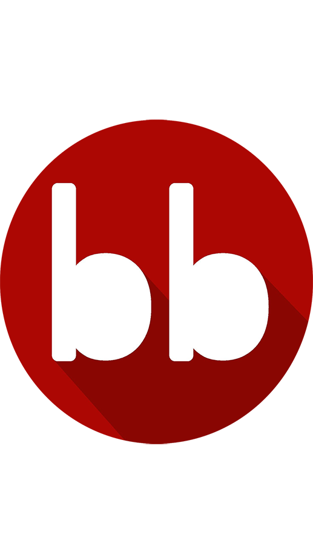

# React Bad Bank

This is a front-end banking application, UNSAFE for production use. The BadBank is called so because it holds all of its information in the front end. 

The purpose of this project is to help showcase front-end development skills as well as help learn complex context methodology.
## Tech Stack

**Client:** React, Bootstrap


## Run Locally

Clone the project

```bash
  git clone https://github.com/red-peel/ReactBadBank
```

Go to the project directory

Start project by initializing a Live Server on index.html.


## 🔗 Links
[](https://katherineoelsner.com/)
[](https://www.linkedin.com/)
[](https://twitter.com/)

